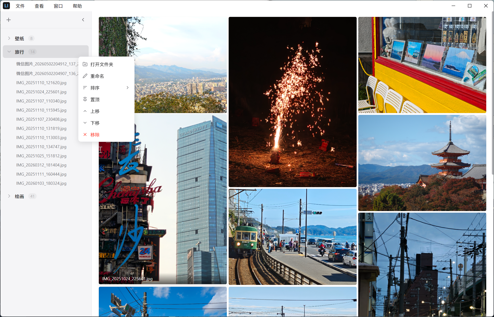
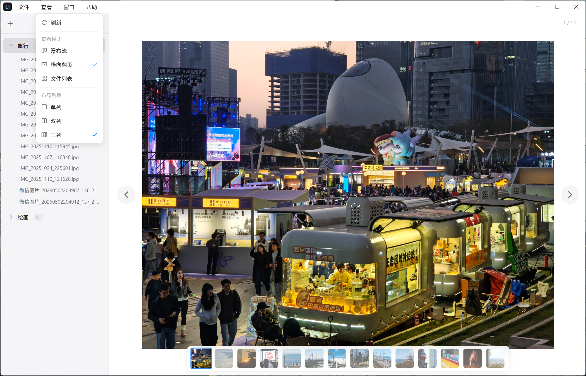
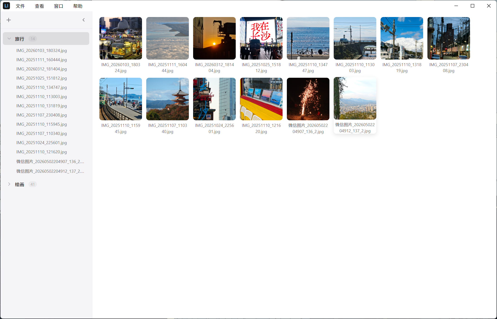

# LanImage

现代轻量 Windows 图片查看器，Electron 架构，三种查看模式。

## 截图

> 瀑布流



> 横向翻页



> 文件列表



## 功能

- 多文件夹管理 — 添加、重命名（别名）、排序、上下移动
- 三种查看模式 — 查看菜单一键切换
  - 瀑布流 — 1/2/3 列，图片按原始比例展示
  - 横向翻页 — 单张浏览，箭头/键盘翻页，缩略图导航，内置缩放拖拽
  - 文件列表 — 等大小网格，正方形缩略图 + 文件名，右键打开文件位置
- 全屏查看器 — 滚轮缩放、放大后拖拽、背景虚化
- 高性能 — 图片尺寸从文件头读取，file:// 协议直接加载

## 支持格式

PNG, JPG/JPEG, GIF, BMP, WebP, SVG, ICO, TIFF/TIF, AVIF

## 快速开始

```bash
npm install
npm start
```

## 打包

```bash
npm run build   # electron-builder 安装包
npm run pack    # electron-packager 可执行文件
```

## 项目结构

```
src/main/main.js       # 主进程
src/preload/preload.js # 预加载（IPC 桥接）
src/renderer/          # 渲染进程
  index.html
  renderer.js
  styles.css
assets/icons/          # 应用图标
config.json            # 运行时配置（自动生成）
```
