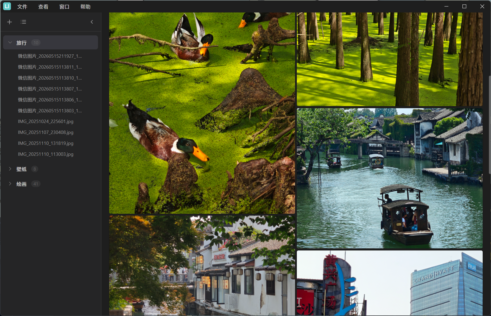

  

<h1 align="center">LanImage</h1>

  
  
  
  
  

## 概述

LanImage 是一款基于 Electron 的轻量级 Windows 图片查看器，内置瀑布流、横向翻页、文件列表三种查看模式，支持预览多种常见的静态和动态图片类型。访问 [Releases](https://github.com/lanseqingling/lan-image/releases) 下载最新版本。

## 功能演示

> 瀑布流

> 横向翻页

> 文件列表

> 深色模式

